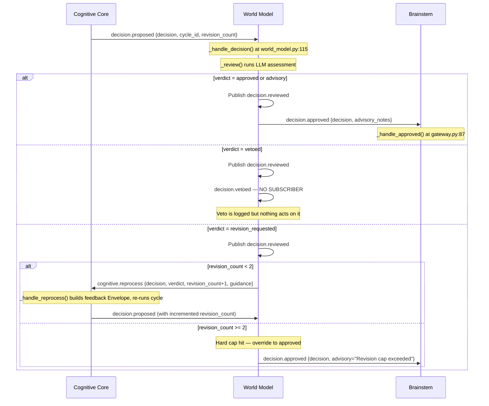
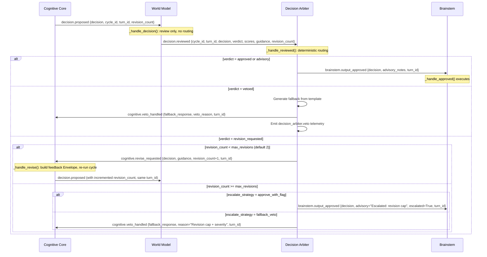

# Phase 8 D3: Decision Arbiter Design Document

**Status:** Approved
**Date:** 2026-04-18
**Scope:** Introduce a first-class Decision Arbiter module between World Model and Brainstem, extracting routing authority from the World Model.

---

## 1. Current Verdict Flow (INCORRECT)

### 1.1 Problem Statement

The World Model currently performs two distinct responsibilities:

1. **Review** (correct): Running an LLM-based 5-dimension assessment of a proposed decision.
2. **Routing** (incorrect): Deciding whether to approve, veto, or send back for revision — including revision-cap escalation logic.

This violates the Single Responsibility Principle. The Brainstem is an output gateway; it should not carry decision authority. The World Model is a reviewer; it should produce a verdict and nothing more. A dedicated Decision Arbiter must sit between World Model and Brainstem to own the routing decision.

### 1.2 Current Event Topology

| Event | Publisher | Subscriber(s) | Purpose |
|-------|-----------|---------------|---------|
| `decision.proposed` | Cognitive Core | World Model | Propose a decision for review |
| `decision.reviewed` | World Model | Cognitive Core (no-op handler) | Publish raw review result |
| `decision.approved` | World Model | Brainstem | Route approved decisions to execution |
| `decision.vetoed` | World Model | (nobody) | Dead event — no subscriber |
| `cognitive.reprocess` | World Model | Cognitive Core | Route revision requests back |

### 1.3 Current Flow: Mermaid Sequence Diagram



### 1.4 Identified Bugs and Design Flaws

| # | Issue | File:Line | Severity |
|---|-------|-----------|----------|
| 1 | **World Model makes routing decisions** — approve/revise/veto routing + revision cap logic | `world_model.py:153-210` | Design flaw |
| 2 | **ReviewVerdict dataclass in event payload** — raw dataclass causes serialization issues | `world_model.py:148` | Bug |
| 3 | **`decision.vetoed` has no subscriber** — veto is published but nothing consumes it | `world_model.py:164` | Bug |
| 4 | **Revision cap hardcoded to 2** despite config `max_revision_cycles: 3` | `world_model.py:181` vs `system.yaml:74` | Bug |
| 5 | **`decision.reviewed` subscriber is a no-op** — `_handle_review_result()` is `pass` | `cognitive_core.py:170,600-603` | Dead code |
| 6 | **Brainstem subscribes directly to `decision.approved`** — output gateway receives from reviewer | `gateway.py:54` | Design flaw |

---

## 2. Target Decision Arbiter Design

### 2.1 Biological Analogy: Anterior Cingulate Cortex (ACC)

In the human brain, the **anterior cingulate cortex** sits between the emotional/evaluative limbic system and the motor cortex. Its function is conflict monitoring and action selection.

In the Sentient framework:
- **Checkpost** gates *input* (sensory filtering — thalamic relay analog).
- **Decision Arbiter** gates *output* (action selection — ACC analog).
- This symmetry is intentional. Both are gatekeepers; one for ingress, one for egress.

### 2.2 Module Identity

| Property | Value |
|----------|-------|
| Module name | `decision_arbiter` |
| File location | `src/sentient/prajna/frontal/decision_arbiter.py` |
| Base class | `ModuleInterface` (from `sentient.core.module_interface`) |
| Dependencies | EventBus, config dict |
| No LLM dependency | Arbiter is deterministic — no inference calls |

### 2.3 Inputs

The Arbiter subscribes to **one event**: `decision.reviewed`.

Reformed payload schema:

```python
{
    "cycle_id": str,
    "turn_id": str,                # NEW: stable ID for the entire review cycle
    "decision": dict,              # The original proposed decision
    "verdict": str,                # "approved" | "advisory" | "revision_requested" | "vetoed"
    "dimension_assessments": dict, # Five-dimension scores from World Model
    "advisory_notes": str,
    "revision_guidance": str,
    "veto_reason": str,
    "confidence": float,
    "revision_count": int,         # How many revisions so far for this turn
}
```

Note: The `ReviewVerdict` dataclass is no longer embedded in the payload. The World Model flattens its verdict into the event payload as plain JSON-safe values. This fixes the serialization bug (issue #2).

### 2.4 Outputs

The Arbiter publishes **exactly one** of three events per incoming `decision.reviewed`:

| Event | Target | When |
|-------|--------|------|
| `brainstem.output_approved` | Brainstem | Verdict is approved/advisory, OR revision cap exceeded with escalation-to-approve |
| `cognitive.revise_requested` | Cognitive Core | Verdict is revision_requested AND revision cap not yet reached |
| `cognitive.veto_handled` | Cognitive Core + telemetry | Verdict is vetoed; Arbiter produces a safe fallback response |

### 2.5 Per-Turn Revision Counter

The Arbiter maintains an in-memory dict mapping `turn_id` to a revision counter.

**Behavior:**

```
on decision.reviewed with verdict="revision_requested":
    turn_id = payload["turn_id"]
    current = self._revision_counter.get(turn_id, 0)
    if current < self.max_revisions:
        self._revision_counter[turn_id] = current + 1
        emit cognitive.revise_requested
    else:
        # Revision cap exceeded — escalate
        emit brainstem.output_approved with escalation flag
```

**Cap exceeded escalation strategy** (configurable):

| Strategy | Behavior | When to use |
|----------|----------|-------------|
| `approve_with_flag` (default) | Approve the original decision with `escalated=True` metadata | Most cases — prevents infinite loops |
| `fallback_veto` | Escalate to `cognitive.veto_handled` with a safe fallback response | High-severity dimensions (ethics score below threshold) |

Stale entries are cleaned up every 60s (TTL: 5 minutes) to bound memory.

### 2.6 Veto Handling

When the World Model vetoes a decision, the Arbiter:

1. **Produces a principled fallback response** from a configurable template.
2. **Emits `cognitive.veto_handled`** with the fallback response and the veto reason.
3. **Emits telemetry** via a `decision_arbiter.veto` event.

**Fallback response template** (configurable in `system.yaml`):

```yaml
decision_arbiter:
  veto_fallback_template: "I need to think about that differently — could you rephrase?"
```

The template supports a single placeholder: `{veto_reason}`.

### 2.7 Health Pulse

```python
def health_pulse(self) -> HealthPulse:
    return HealthPulse(
        module_name=self.name,
        status=self._last_health_status,
        metrics={
            "approved_count": self._approved_count,
            "veto_handled_count": self._veto_handled_count,
            "revise_requested_count": self._revise_requested_count,
            "escalation_count": self._escalation_count,
            "active_turns": len(self._revision_counter),
            "total_routed": self._total_routed,
        },
    )
```

---

## 3. Target Event Flow Diagram

### 3.1 Mermaid Sequence Diagram (Post-Phase-8)



### 3.2 Event Topology Diff

| Old Event | New Event | Change |
|-----------|-----------|--------|
| `decision.approved` | `brainstem.output_approved` | Renamed; Brainstem subscribes here instead |
| `decision.vetoed` | `cognitive.veto_handled` | Renamed; now has a subscriber and produces fallback |
| `cognitive.reprocess` | `cognitive.revise_requested` | Renamed; clearer semantics |
| `decision.reviewed` | `decision.reviewed` | **Reformed payload** (flat, no embedded dataclass) |
| (none) | `decision_arbiter.veto` | **NEW**: telemetry event for veto monitoring |

---

## 4. Interface Contract

### 4.1 Class Interface

```python
class DecisionArbiter(ModuleInterface):
    """Deterministic action selector between World Model review and Brainstem execution.

    Biological analogy: anterior cingulate cortex (ACC) — conflict monitoring
    and action selection. The Arbiter resolves which action wins when the
    World Model produces a verdict.

    Mirror note: Checkpost gates input; Arbiter gates output. Symmetry is intentional.
    """

    def __init__(
        self,
        config: dict[str, Any],
        event_bus: EventBus | None = None,
    ) -> None:
        self.max_revisions: int = config.get("max_revisions", 2)
        self.escalate_strategy: str = config.get("escalate_strategy", "approve_with_flag")
        self.veto_fallback_template: str = config.get(
            "veto_fallback_template",
            "I need to think about that differently — could you rephrase?",
        )
        self.ethics_escalation_threshold: float = config.get(
            "ethics_escalation_threshold", 0.3,
        )
        self.stale_turn_ttl_seconds: int = config.get("stale_turn_ttl_seconds", 300)

        self._revision_counter: dict[str, int] = {}  # turn_id -> count
        self._sweep_task: asyncio.Task | None = None
        self._approved_count: int = 0
        self._veto_handled_count: int = 0
        self._revise_requested_count: int = 0
        self._escalation_count: int = 0
        self._total_routed: int = 0

    async def initialize(self) -> None:
        await self.event_bus.subscribe("decision.reviewed", self._handle_reviewed)

    async def start(self) -> None:
        self._sweep_task = asyncio.create_task(self._stale_counter_sweep())
        self.set_status(ModuleStatus.HEALTHY)

    async def shutdown(self) -> None:
        if self._sweep_task:
            self._sweep_task.cancel()

    async def _handle_reviewed(self, payload: dict[str, Any]) -> None:
        """Core routing logic: one input, exactly one output."""
        ...

    async def _stale_counter_sweep(self) -> None:
        """Periodic cleanup of stale turn revision counters."""
        ...
```

### 4.2 Event Schemas

#### `decision.reviewed` (reformed payload from World Model)

```python
{
    "cycle_id": str,
    "turn_id": str,                 # NEW: stable turn identifier
    "decision": dict,               # The proposed DecisionAction as dict
    "verdict": str,                 # "approved" | "advisory" | "revision_requested" | "vetoed"
    "dimension_assessments": {      # Flat dict from DimensionAssessments.model_dump()
        "feasibility": {"score": float, "notes": str},
        "consequence": {"score": float, "notes": str},
        "ethics": {"score": float, "notes": str},
        "consistency": {"score": float, "notes": str},
        "reality_grounding": {"score": float, "notes": str},
    },
    "advisory_notes": str,
    "revision_guidance": str,
    "veto_reason": str,
    "confidence": float,
    "revision_count": int,
}
```

#### `brainstem.output_approved` (output to Brainstem)

```python
{
    "turn_id": str,
    "decision": dict,
    "advisory_notes": str,
    "escalated": bool,              # True if approved via cap escalation
    "escalation_reason": str,       # "revision_cap_exceeded" | ""
}
```

#### `cognitive.revise_requested` (output to Cognitive Core)

```python
{
    "turn_id": str,
    "cycle_id": str,
    "decision": dict,
    "revision_guidance": str,
    "revision_count": int,          # New count (incremented)
    "max_revisions": int,          # Config value, for Cognitive Core visibility
}
```

#### `cognitive.veto_handled` (output to Cognitive Core on veto)

```python
{
    "turn_id": str,
    "cycle_id": str,
    "fallback_response": str,
    "veto_reason": str,
    "decision": dict,               # The vetoed decision (for Cognitive Core's model update)
}
```

### 4.3 Configuration Schema

Add to `config/system.yaml`:

```yaml
decision_arbiter:
  max_revisions: 2
  escalate_strategy: "approve_with_flag"
  veto_fallback_template: "I need to think about that differently — could you rephrase?"
  ethics_escalation_threshold: 0.3
  stale_turn_ttl_seconds: 300
```

The `veto_loop.max_revision_cycles` key in the World Model config section is **removed** — this config moves to `decision_arbiter.max_revisions`.

---

## 5. Migration Strategy

### 5.1 Step-by-Step Extraction

| Step | What Changes | Files Affected | Risk |
|------|-------------|----------------|------|
| **1. Create Arbiter module** | New file `src/sentient/prajna/frontal/decision_arbiter.py` | NEW | Low |
| **2. Add config** | Add `decision_arbiter:` section to `config/system.yaml` | `system.yaml` | Low |
| **3. Wire Arbiter in main.py** | Import, construct, register DecisionArbiter between World Model and Brainstem | `main.py` | Low |
| **4. Reform World Model** | Remove routing logic (lines 152-210). Keep only: LLM review + journal + publish flat `decision.reviewed`. Remove `ReviewVerdict` embedding. | `world_model.py:115-210` | **High** |
| **5. Change Brainstem subscription** | Change from `"decision.approved"` to `"brainstem.output_approved"` | `gateway.py:54` | Medium |
| **6. Change Cognitive Core subscriptions** | Change from `"cognitive.reprocess"` to `"cognitive.revise_requested"`. Remove `decision.reviewed` no-op. Add `cognitive.veto_handled` handler. | `cognitive_core.py` | Medium |
| **7. Add unit tests** | Arbiter routing logic tests | NEW: `tests/unit/frontal/test_decision_arbiter.py` | Low |
| **8. Update integration tests** | Fix any tests using old event names | `tests/` | Medium |

### 5.2 World Model: What Stays vs What Leaves

**Stays:**
- LLM review (`_review()`)
- Review prompt building (`_build_review_prompt()`)
- Response parsing (`_parse_review()`)
- Journal append
- Statistics tracking
- Health pulse
- `decision.proposed` subscription

**Leaves (moves to Arbiter):**
- Approved/advisory routing: `decision.approved` publish → Arbiter: `brainstem.output_approved`
- Vetoed routing: `decision.vetoed` publish → Arbiter: `cognitive.veto_handled`
- Revision routing: `cognitive.reprocess` publish → Arbiter: `cognitive.revise_requested`
- Revision cap logic (hard cap at 2, override to approved) → Arbiter: configurable `max_revisions` + escalation strategy
- Config key `veto_loop.max_revision_cycles` → Arbiter: `decision_arbiter.max_revisions`

### 5.3 Brainstem: What Changes

| Current | New |
|---------|-----|
| Subscribes to `"decision.approved"` | Subscribes to `"brainstem.output_approved"` |
| `_handle_approved()` receives `{cycle_id, decision, advisory_notes}` | `_handle_approved()` receives `{turn_id, decision, advisory_notes, escalated, escalation_reason}` |

### 5.4 Cognitive Core: What Changes

| Current | New |
|---------|-----|
| Subscribes to `"decision.reviewed"` (no-op) | **REMOVE** subscription and handler |
| Subscribes to `"cognitive.reprocess"` | Subscribes to `"cognitive.revise_requested"` |
| `_handle_reprocess()` | Renamed to `_handle_revise_requested()` |
| `_current_revision_count` instance var | Uses `revision_count` from payload; `turn_id` replaces ad-hoc tracking |
| (none) | NEW: Subscribe to `"cognitive.veto_handled"` with handler |

### 5.5 turn_id Introduction

Currently, `cycle_id` identifies a reasoning cycle, but a single turn (user input → final output) can span multiple cycles due to revision loops. The `turn_id` provides a stable identifier across all revision cycles within one turn.

**Generation**: The Cognitive Core generates a `turn_id` when it first receives an enriched input. It is a UUID that remains constant across all revision cycles for that turn.

**Propagation**: Cognitive Core → World Model → Arbiter, with `turn_id` included in every event payload.

---

## 6. Design Decisions and Trade-offs

| Decision | Choice | Rationale |
|----------|--------|-----------|
| Arbiter is deterministic (no LLM) | Yes | Routing is control-flow, not reasoning. LLM adds latency and nondeterminism. |
| `max_revisions` default is 2 | Yes | Matches current hard-coded value. Config allows override. |
| `escalate_strategy` default is `approve_with_flag` | Yes | Preserves existing behavior while adding `escalated` flag for observability. |
| Veto produces a fallback response | Yes | Current system silently drops vetoed decisions. A user-facing system must always produce output. |
| `turn_id` as new identifier | Yes | `cycle_id` changes on every revision; `turn_id` provides stability for cap tracking. |
| Arbiter lives in `prajna/frontal/` | Yes | Part of the frontal decision-making system alongside Cognitive Core and World Model. |

---

## 7. References

- `src/sentient/prajna/frontal/world_model.py:115-210` — Current routing logic
- `src/sentient/prajna/frontal/cognitive_core.py:170-171,605-644` — Current subscriptions + revision handler
- `src/sentient/brainstem/gateway.py:54,87-97` — Current Brainstem subscription + handler
- `src/sentient/core/event_bus.py:78-82` — Current event type definitions
- `src/sentient/core/module_interface.py` — ModuleInterface contract
- `config/system.yaml:73-74` — Current veto_loop.max_revision_cycles config
- `src/sentient/main.py:130-157` — Module construction and registration order