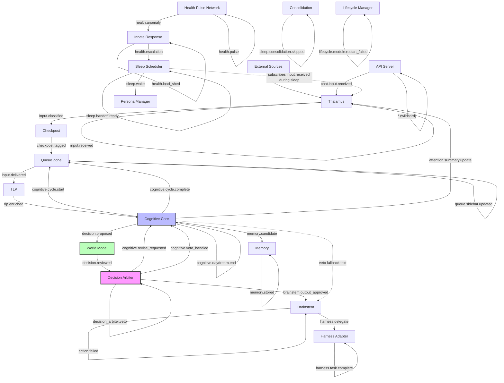
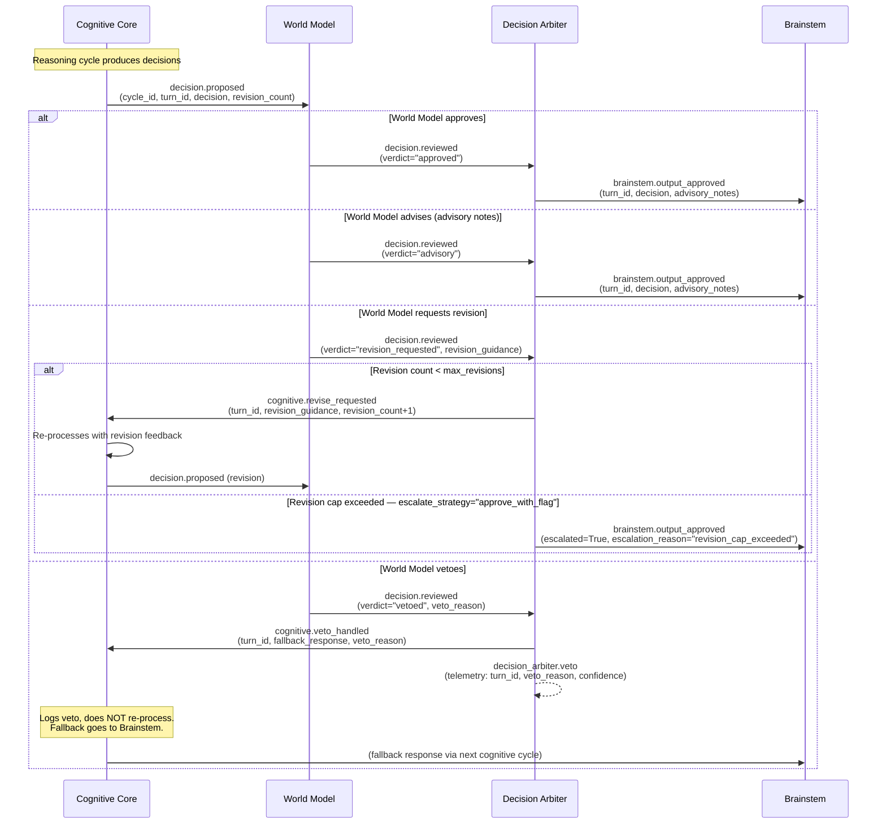

# Phase 8 D6: Post-Phase-8 Event Connection Topology

**Date:** 2026-04-18
**Status:** Current as of Phase 8 D4

## 1. Event Flow Diagram

## 2. Event Registry

| Event | Publisher | Subscriber(s) | Payload Shape |
|-------|-----------|---------------|---------------|
| `input.received` | Thalamus | Sleep Scheduler (during sleep) | `envelope_id`, `source_type`, `priority`, `envelope` |
| `input.classified` | Thalamus | Checkpost | `envelope` (Envelope) |
| `input.delivered` | Queue Zone | TLP | `envelope` (Envelope), `sidebar` (list[Envelope]) |
| `checkpost.tagged` | Checkpost | Queue Zone | `envelope` (Envelope) |
| `queue.sidebar.updated` | Queue Zone | — (telemetry) | `sidebar_size` |
| `tlp.enriched` | TLP | Cognitive Core | `context` (EnrichedContext) |
| `cognitive.cycle.start` | Cognitive Core | Queue Zone | `cycle_id`, `is_daydream` |
| `cognitive.cycle.complete` | Cognitive Core | Queue Zone, API Server | `cycle_id`, `is_daydream`, `monologue`, `decision_count`, `duration_ms` |
| `cognitive.daydream.start` | Cognitive Core | — (telemetry) | `daydream_count` |
| `cognitive.daydream.end` | Cognitive Core | — (telemetry) | `daydream_count` |
| `cognitive.revise_requested` | Decision Arbiter | Cognitive Core | `turn_id`, `cycle_id`, `decision`, `revision_guidance`, `revision_count`, `max_revisions` |
| `cognitive.veto_handled` | Decision Arbiter | Cognitive Core | `turn_id`, `cycle_id`, `fallback_response`, `veto_reason`, `decision` |
| `decision.proposed` | Cognitive Core | World Model | `cycle_id`, `turn_id`, `decision`, `context_envelope_id`, `revision_count` |
| `decision.reviewed` | World Model | Decision Arbiter | `cycle_id`, `turn_id`, `decision`, `verdict`, `dimension_assessments`, `advisory_notes`, `revision_guidance`, `veto_reason`, `confidence`, `revision_count` |
| `brainstem.output_approved` | Decision Arbiter | Brainstem | `turn_id`, `decision`, `advisory_notes`, `escalated`, `escalation_reason` |
| `decision_arbiter.veto` | Decision Arbiter | — (telemetry) | `turn_id`, `cycle_id`, `veto_reason`, `confidence`, `dimension_assessments` |
| `action.executed` | Brainstem | API Server | `command_id`, `plugin`, `capability`, `duration_ms` |
| `action.failed` | Brainstem | API Server | `command_id`, `plugin`, `error` |
| `harness.delegate` | Brainstem | Harness Adapter | `goal`, `context`, `constraints`, `success_criteria` |
| `harness.task.complete` | Harness Adapter | — (telemetry) | `task_id`, `success`, `output`, `error` |
| `memory.candidate` | Cognitive Core | Memory | `cycle_id`, `candidate`, `source_envelope_id` |
| `memory.stored` | Memory | — (telemetry) | `memory_id`, `memory_type`, `importance` |
| `health.pulse` | Health Pulse Network | — (telemetry) | `module_name`, `status`, `metrics`, `notes`, `timestamp` |
| `health.anomaly` | Health Pulse Network | Innate Response | `module_name`, `status`, `metrics`, `notes`, `timestamp` |
| `health.load_shed` | Innate Response | — (telemetry) | `module_name`, `severity` |
| `health.escalation` | Innate Response | Sleep Scheduler | `module_name`, `severity`, `message`, `what_tried`, `timestamp` |
| `sleep.stage.transition` | Sleep Scheduler | — (telemetry) | `stage`, `cycle` |
| `sleep.maintenance.running` | Sleep Scheduler | — (telemetry) | `cycle` |
| `sleep.handoff.ready` | Sleep Scheduler | — (telemetry) | `handoff` (dict) |
| `sleep.wake` | Sleep Scheduler | Persona Manager | `cycle`, `wake_up_inbox_count` |
| `sleep.consolidation.skipped` | Consolidation | — (telemetry) | `reason`, `count` |
| `sleep.consolidation.cycle_start` | Consolidation | — (telemetry) | `episode_count` |
| `sleep.consolidation.cycle_complete` | Consolidation | — (telemetry) | `facts_extracted`, `patterns_extracted`, `episodes_processed`, `duration_seconds`, `semantic_timeout`, `procedural_timeout` |
| `attention.summary.update` | Cognitive Core | Thalamus | `summary` (`current_focus`, `idle_seconds`, `recent_cycle_count`) |
| `lifecycle.startup.complete` | Lifecycle Manager | — (telemetry) | `module_count`, `failed_count` |
| `lifecycle.module.restarted` | Lifecycle Manager | — (telemetry) | `module_name` |
| `lifecycle.module.restart_failed` | Lifecycle Manager | — (telemetry) | `module_name`, `error` |
| `chat.input.received` | API Server | — (telemetry) | `turn_id`, `text`, `timestamp` |
| `internal.queue_item` | (internal sources) | Queue Zone | `envelope` (Envelope) |

## 3. Decision Flow (Detailed)

## 4. Changes from Pre-Phase-8

| Old Event | New Event | Reason |
|-----------|-----------|--------|
| `decision.approved` | `brainstem.output_approved` | Arbiter extraction: Decision Arbiter now owns the approve/reject routing, not World Model |
| `cognitive.reprocess` | `cognitive.revise_requested` | Clearer semantics: revision is requested by Arbiter, not a re-process trigger |
| `decision.vetoed` | `cognitive.veto_handled` | Arbiter extraction + fallback: veto is now handled by Arbiter producing a fallback, not a direct re-process |
| (none) | `decision_arbiter.veto` | New telemetry event emitted alongside `cognitive.veto_handled` for observability |
| `decision.reviewed` | `decision.reviewed` | REFORMED: flat payload with no embedded dataclass; `ReviewVerdict` fields are now top-level keys (`verdict`, `dimension_assessments`, `advisory_notes`, `revision_guidance`, `veto_reason`, `confidence`, `revision_count`) |

## 5. Module Subscription Map

| Module | Subscribes To | Publishes |
|--------|--------------|-----------|
| **Thalamus** | `attention.summary.update` | `input.received`, `input.classified` |
| **Checkpost** | `input.classified` | `checkpost.tagged` |
| **Queue Zone** | `checkpost.tagged`, `internal.queue_item`, `cognitive.cycle.start`, `cognitive.cycle.complete` | `input.delivered`, `queue.sidebar.updated` |
| **TLP** | `input.delivered` | `tlp.enriched` |
| **Cognitive Core** | `tlp.enriched`, `cognitive.revise_requested`, `cognitive.veto_handled` | `cognitive.cycle.start`, `cognitive.cycle.complete`, `cognitive.daydream.start`, `cognitive.daydream.end`, `decision.proposed`, `memory.candidate`, `attention.summary.update` |
| **World Model** | `decision.proposed` | `decision.reviewed` |
| **Decision Arbiter** | `decision.reviewed` | `brainstem.output_approved`, `cognitive.revise_requested`, `cognitive.veto_handled`, `decision_arbiter.veto` |
| **Brainstem** | `brainstem.output_approved` | `action.executed`, `action.failed`, `harness.delegate` |
| **Harness Adapter** | `harness.delegate` | `harness.task.complete` |
| **Memory** | `memory.candidate` | `memory.stored` |
| **Health Pulse Network** | — (polls modules) | `health.pulse`, `health.anomaly` |
| **Innate Response** | `health.anomaly` | `health.load_shed`, `health.escalation` |
| **Sleep Scheduler** | `health.escalation`, `input.received` (during sleep) | `sleep.stage.transition`, `sleep.maintenance.running`, `sleep.handoff.ready`, `sleep.wake` |
| **Consolidation** | — (called by scheduler) | `sleep.consolidation.skipped`, `sleep.consolidation.cycle_start`, `sleep.consolidation.cycle_complete` |
| **Persona Manager** | `sleep.consolidation.developmental`, `sleep.wake` | — |
| **API Server** | `*` (wildcard) | `chat.input.received` |
| **Lifecycle Manager** | — | `lifecycle.startup.complete`, `lifecycle.module.restarted`, `lifecycle.module.restart_failed` |

## 6. Key Architectural Invariants

1. **One-to-one routing**: `decision.reviewed` has exactly one subscriber (Decision Arbiter). The Arbiter then fans out to one of three output events based on verdict. This replaces the old World-Model-routes-directly pattern.

2. **Flat payload contract**: All events crossing module boundaries use flat dict payloads. The `decision.reviewed` event was reformed in Phase 8 D4 to carry `ReviewVerdict` fields as top-level keys rather than embedding the dataclass object.

3. **Veto fallback path**: When a decision is vetoed, the Arbiter emits both `cognitive.veto_handled` (to notify CC) and `decision_arbiter.veto` (telemetry). CC logs the veto but does not re-process; the fallback text is carried in the veto payload and eventually reaches Brainstem.

4. **Revision cap**: The Arbiter tracks per-turn revision counts with TTL-based cleanup (`stale_turn_ttl_seconds`, default 300s). When `max_revisions` (default 2) is exceeded, the escalate strategy (`approve_with_flag` or `fallback_veto`) determines the output.

5. **Wildcard subscriber**: API Server subscribes to `*` for WebSocket broadcast, making it a universal event consumer. All other modules subscribe to specific event types.

6. **Envelopes stay as objects**: In the input pipeline (`input.received` through `checkpost.tagged` and `input.delivered`), Envelope objects are passed through the event bus directly. The `_to_json_safe` helper in EventBus handles serialization for WebSocket egress.
